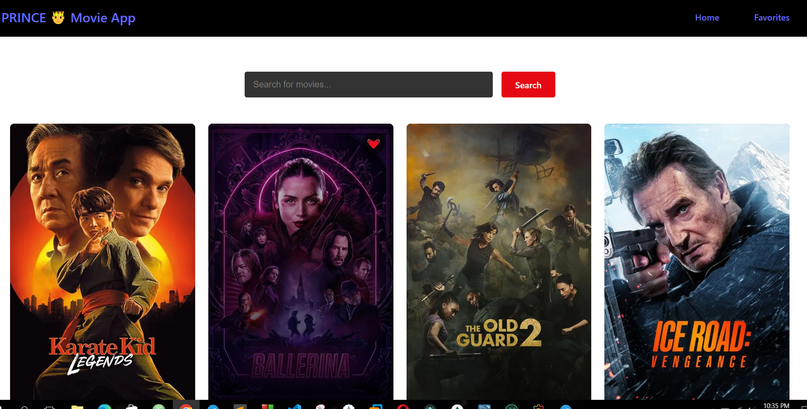

# 🎬 R🤴YAL Movie - JavaScript Edition  

This is a react base-based movie discovery app, that lets users search films, view details and save favorites.
It is Powered by [The Movie Database (TMDb) API](https://www.themoviedb.org/).

 

## ✨ Key Features  

- Instant Search - Find movies as you type  
- Favorites Storage - Saves to localStorage   
- Movie Details - Summary, release date  

## 🛠️ Stack  
- Frontend: JavaScript (ES6+)  
- Styling: CSS3 (Flexbox/Grid)  
- API: TMDb REST API  
- Bundler: Parcel/Vite (if configured)  

## 🚀 Quick Start  

# 1. Clone the repo

# 2. Install dependencies
npm install

# 3. Add API key in api.js
const API_KEY = "your_tmdb_key_here";

# 4. Launch app
npm run dev  # or open index.html

## 🔮 Future Improvements 

Here is how i plan to upgrade this project

### 1. Enhanced Features  
- 🎥 Add TV shows section  
- 🧑‍💻 User authentication (Firebase/Auth0)  
- 📝 User reviews/ratings system  
- 🎬 Trailer integration (YouTube API)  

### 2. Technical Upgrades  
- ⚡️ Migrate to Next.js for SSR/SEO benefits  
- 🧩 Implement GraphQL version of TMDb API  
- 📱 Add PWA capabilities for offline use  
- 🧪 Write unit/integration tests (Jest + React Testing Library)  

### 3. UI/UX Improvements  
- ✨ Animations with Framer Motion  
- 🎨 Theming system (styled-components)  
- 🔄 Infinite scroll for movie listings  
- 📊 Data visualization for movie stats  

## 🤝 Contributing  

Contributions are welcome! If you want to improve this project:  

1. Fork the repository  
2. Create your feature branch (git checkout -b feature/AmazingFeature)  
3. Commit your changes (git commit -m 'Add some AmazingFeature')  
4. Push to the branch (git push origin feature/AmazingFeature)  
5. Open a Pull Request  

## 📜 License  

Distributed under the MIT License.  

## 📧 Contact  

Mark Marko - [@yourtwitter](https://x.com/MarkMarko1234) - princetmk10@gmail.com  

Project Link: [https://github.com/TIZIHMARKP/private_MovieApp.git](https://github.com/TIZIHMARKP/private_MovieApp.git)